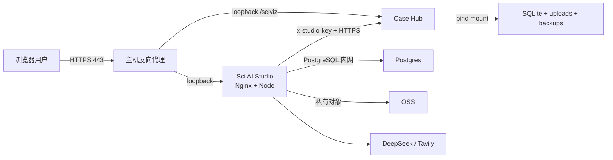

# Sci AI Studio / Case Hub 生产运行手册

更新日期：2026-07-16

## 目标与边界

本手册用于把 Sci AI Studio 与 Sci-Viz Case Hub 安全、可维护地部署到生产环境，并确保失败时可诊断、可恢复、可回滚。

当前不包含内部账号、小流量灰度或账号开放计划。发布判断只依据安全、数据完整性、核心功能、视觉正确性和运维可恢复性，不以“先让少量用户试用”代替质量门槛。

“零 bug”不能靠承诺证明。只有本手册中的发布硬门槛全部有可复核证据时，版本才允许上线。

## 系统与信任边界



- 公网只开放 443；Studio 和 Case Hub 的宿主机端口只绑定 `127.0.0.1`。
- Studio → Case Hub 只允许 HTTPS `/api` 基地址，并使用独立的 `CASE_HUB_STUDIO_KEY`；推荐接口必须协商 `x-studio-contract-version: 1`，响应体也必须为 `contractVersion: 1`。
- Case Hub 的 SQLite、上传文件、期刊封面和一致性备份必须全部位于持久化目录。
- Studio 的业务数据必须进入 Postgres，文件进入私有 OSS；生产禁止本地 JSON/本地对象存储降级。
- 日志不得记录 Clerk、JWT、Review Token、Studio Service Key、OSS 或 AI 密钥，也不得把下游错误原文返回浏览器。

## 发布优先级

| 优先级 | 工作 | 发布要求 |
| --- | --- | --- |
| P0 | 鉴权、权限隔离、SSRF、上传校验、错误脱敏、密钥与 CORS、数据持久化 | 任一失败立即阻断 |
| P0 | 数据库/对象存储备份与恢复、健康检查、不可变镜像、失败回滚 | 必须有实际演练证据 |
| P0 | Studio ↔ Case Hub 契约、登录、上传、保存恢复、AI 任务、方案输出核心路径 | 必须通过真实生产配置的 staging smoke test |
| P1 | 桌面/移动端视觉、可访问性、性能包体、错误/空状态 | 关键页面不得重叠、溢出、白屏或阻断操作 |
| P1 | 高风险臃肿文件拆分 | 先补 characterization test，再按领域边界抽取；禁止为了行数拆成无语义碎片 |
| P2 | 普通重命名、样式整理、非瓶颈优化 | 不得挤占 P0/P1 验证时间 |

当前优先拆分对象：Case Hub `routes/insights.ts`、`CaseList.tsx`、`InsightsPage.tsx`；Studio `WorkflowNodeCard.tsx`、`AgentContextPanel.tsx` 和按领域继续拆分 CSS。爬虫适配器虽然行数更大，但属于规则数据集合，只有在新增来源明显难以审查或出现回归时才按站点拆分。

## 发布硬门槛

### 1. 代码和供应链

- 两个仓库的类型检查、全部测试、生产构建均成功。
- `npm audit --omit=dev --audit-level=high` 无 High/Critical 阻断项。
- GitHub Actions 必须固定到完整 commit SHA。
- 只部署 `ghcr.io/...:<full-git-sha>`；禁止 `latest`、服务器 `git pull`、服务器源码构建。
- 镜像必须完成 SBOM/provenance 生成和 Trivy High/Critical 扫描。
- PR 中不得包含 `.env`、数据库、访问令牌、浏览器登录态或生产数据样本。

### 2. 配置和密钥

- Studio 必填：Postgres、Clerk、OSS、DeepSeek、Tavily、Case Hub HTTPS URL 和服务密钥。
- Case Hub 必填：强 JWT、精确 HTTPS CORS origins、Studio service key。
- Review Token、JWT、Studio key 使用不同随机值，长度不少于 32；不能使用示例值。
- GitHub `production` environment 启用人工审批；SSH key 仅有部署目录和 Docker 所需权限。
- 密钥轮换必须记录时间、负责人、受影响服务和验证结果；泄漏时先吊销再排障。

### 3. 数据备份和恢复

发布前创建带时间戳的备份目录，备份必须加密并复制到不同故障域。

Studio Postgres：

```sh
mkdir -p backups/studio
docker compose -f docker-compose.prod.yml exec -T postgres \
  pg_dump -U studio -d studio -Fc > "backups/studio/studio-$(date +%Y%m%d-%H%M%S).dump"
```

恢复演练必须在隔离的临时 Postgres 中执行 `pg_restore --clean --if-exists`，然后核对项目、工作流、资料、方案、审核链接、用量和反馈表的行数与抽样记录。禁止第一次在生产事故中尝试恢复。

Case Hub 使用应用内 `VACUUM INTO` 一致性备份；禁止运行中直接复制 WAL 模式的 `dev.db`。生产 Compose 已把 `server/backups` 挂载到 `${CASE_HUB_DATA_DIR}/backups`。同时备份：

- `${CASE_HUB_DATA_DIR}/prisma`
- `${CASE_HUB_DATA_DIR}/uploads`
- `${CASE_HUB_DATA_DIR}/journal_covers`
- `${CASE_HUB_DATA_DIR}/backups`

每次恢复演练至少执行 SQLite `PRAGMA integrity_check`、案例行数核对、随机图片可读性检查和 Studio 推荐接口抽样。建议目标：RPO 不超过 24 小时，RTO 不超过 4 小时；正式承诺前必须用真实数据量演练校准。

Case Hub 在生产发现数据库文件缺失时会拒绝自动创建。仅首次受控初始化可临时设置 `CASE_HUB_ALLOW_DATABASE_INITIALIZATION=true`，完成后立即恢复为 `false` 并建立首份备份。

### 4. 部署顺序和验证

1. 记录当前 Studio 与 Case Hub 镜像 SHA、容器状态和数据库备份位置。
2. 先发布 Case Hub，等待 `/api/health` 就绪。
3. 使用有效的 Studio service key 和 v1 契约头验证 `/api/studio/recommendations`；401、406、版本/DTO 不匹配或超时均阻断。
4. 再发布 Studio，等待 `/api/v1/health` 返回数据库就绪。
5. 从外部 HTTPS 域名执行 smoke test，不能只请求容器内部端口。
6. 观察错误率、延迟、容器重启、CPU/内存/磁盘至少一个完整核心流程周期；这不是账号灰度，而是发布验证。

必须覆盖的 smoke test：

- 登录与退出；未登录访问被拒绝，用户不能读取其他用户项目。
- 创建项目、文字资料、合法 PDF/DOCX/JPG/PNG 上传；伪造 MIME、超限文件和私网 URL 被拒绝。
- 资料解析 → 项目理解 → 人工确认 → 目标配置 → Case Hub 推荐。
- 保存后刷新恢复、版本恢复、审核链接过期/撤销、反馈持久化。
- 桌面 1440px、常规 1200px、移动 390px；检查控制台、横向溢出、遮挡、焦点和错误状态。

### 5. 回滚

- 应用失败：回到部署前记录的镜像 digest/SHA，不重写代码、不临时在服务器修文件。
- 数据结构或数据作业失败：先停止写入，再按经过演练的备份恢复；不要只回滚应用而保留不兼容数据。
- 回滚后重新执行健康检查和最小 smoke test，并保存失败日志与 request ID。
- 自动回滚失败时保持故障版本退出服务，不允许把“容器运行中”当成恢复成功。

## 监控与事故处理

至少监控：

- `/api/health`、`/api/v1/health` 可用性与延迟。
- 5xx、429、鉴权失败、Case Hub 依赖失败、AI/Tavily/OSS 超时率。
- Postgres 连接、SQLite 完整性、备份最后成功时间与备份大小异常。
- 容器重启、内存、CPU、PID、磁盘和日志增长。
- 上传失败、解析队列积压、Agent 队列积压与任务最终失败数。

事故顺序：保护数据和密钥 → 停止扩大影响 → 保存日志/request ID/版本 → 回滚或隔离依赖 → 验证恢复 → 形成复盘和防复发测试。任何日志或截图进入工单前必须脱敏。

## 日常维护

- 每日：健康端点、错误率、队列、磁盘、备份成功时间。
- 每周：依赖审计、Trivy、失败任务抽样、上传/推荐/保存 smoke test。
- 每月：证书和密钥到期检查、权限复核、容量趋势、SQLite integrity check。
- 每季度：完整 Postgres/SQLite/OSS 恢复演练、密钥轮换演练、故障回滚演练。
- 数据补采、回填、批处理必须先 dry-run、备份、设置并发/数量上限、记录输入范围和结果，禁止与发布同时执行。

## 当前明确未验证项

以下项目在完成前不能宣称“可安全上线”：

- 在 Node 22 + Docker 环境实际构建并扫描 Studio 镜像。
- 在 Node 24 + Docker 环境实际构建并扫描 Case Hub 镜像。
- 使用真实 Postgres、私有 OSS、Clerk、DeepSeek、Tavily 与 Case Hub service key 的 staging 全链路。
- Postgres 实际备份/恢复、Case Hub 持久目录整体恢复和 OSS 恢复演练。
- 真实反向代理/TLS 下的外部 smoke test、限流客户端 IP 识别和安全响应头检查。
- CI 生产 environment 审批、SSH 权限、失败自动回滚与磁盘告警实测。

这些是环境证据缺口，不应通过修改代码或增加测试数量来假装已经验证。
